# Machine Learning Project: Linear Regression & Beyond

We first create a cell for all the libraries we will need to import for our project. We will use pandas to import and manipulate data easily through DataFrames, NumPy for linear algebra & complex operations over lists, Matplotlib for displaying 2D plots, Seaborn for displaying correlation heatmaps, scikit-learn for model engineering & some extra utilities.


```python
import time
from math import sqrt

import numpy as np
import seaborn as sns
import pandas as pd
import matplotlib.pyplot as plt

from sklearn import linear_model
from sklearn.ensemble import GradientBoostingRegressor
from sklearn.ensemble import RandomForestRegressor
from sklearn.preprocessing import MinMaxScaler
from sklearn.preprocessing import PolynomialFeatures
from sklearn.model_selection import train_test_split
from sklearn.metrics import mean_absolute_error, mean_squared_error, r2_score
```

We set some parameters to increase the height of Matplotlib figures and pandas print outputs so they can be displayed properly in the notebook.


```python
from pylab import rcParams
rcParams['figure.figsize'] = 20, 5

pd.set_option('display.max_rows', 500)
pd.set_option('display.max_columns', 30)
pd.set_option('display.width', 1000)
```

We create a function to display and analyse the results of our regressions feature-by-feature (with scatter plots & lines corresponding to the coefficients of each weight).


```python
def plot_weights_data_biasless(plt, X, y, w, title, same_scale = True):
    intercept = w[0]
    w = w[1:]
    
    n = len(w)
    fig, axs = plt.subplots(2, n)
    fig.suptitle(title, fontsize=20)
    y_scale_line = (-1*((max(y)-min(y))/2), (max(y)-min(y))/2)
    y_scale = (min(y), max(y))
    
    x_minimums = X.T.min(axis = 1)
    x_maximums = X.T.max(axis = 1)
    x_size = x_maximums - x_minimums
    max_size = max(x_size)
    
    x = np.linspace(-100, 100, 100)
    for i in range(n):
        if same_scale:
            diff_size = max_size - x_size[i]
            x_scale = (x_minimums[i] - diff_size/2, x_maximums[i] + diff_size/2)            # We make it so all x scales are on the same scale
            
            if (n > 1):
                axs[0][i].set_xlim(x_scale)
                axs[0][i].set_ylim(y_scale)
            else:
                axs[0].set_xlim(x_scale)
                axs[0].set_ylim(y_scale)
                
            heatmap, xedges, yedges = np.histogram2d(np.concatenate((X[:, i], x_scale)),    # We add a point in the upper-left corner and upper-right corner of the heatmap
                                                     np.concatenate((y, y_scale)), bins=50) # so all heatmaps will have the same edges and be displayed correctly
        else:
            heatmap, xedges, yedges = np.histogram2d(X[:, i], y, bins=50)
        
        extent = [xedges[0], xedges[-1], yedges[0], yedges[-1]]
        
        if (n > 1):
            axs[0][i].imshow(heatmap.T, extent=extent, origin='lower')

            axs[1][i].set_xlim((-2, 2))
            axs[1][i].set_ylim(y_scale_line)
            axs[1][i].plot(x, w[i]*x, c="red", linewidth=2)
        else:
            axs[0].imshow(heatmap.T, extent=extent, origin='lower')

            axs[1].set_xlim((-2, 2))
            axs[1].set_ylim(y_scale_line)
            axs[1].plot(x, w[i]*x, c="red", linewidth=2)
        
    fig.tight_layout()
```

# First Dataset: Analysis & Model Fitting of the Powerplant Dataset

The dataset can found at: https://archive.ics.uci.edu/ml/datasets/Combined+Cycle+Power+Plant. The dataset contains 4 variables and one output.


```python
def load_data_excel(excel_path, y_label, drops=[]):
    df = pd.read_excel(excel_path, sheet_name=None)  # Excel datasets might be spread over multiple sheets. To concactenate all the sheets into one DataFrame,
    df = pd.concat(df, ignore_index=True)            # we use the "sheet_name=None" argument when reading and then pd.concat with "ignore_index=True"
    
    for drop in drops:                               # We add an optional "drops" argument, telling which columns to drop as soon as the data is loaded
        df = df.drop(drop, axis=1)
    
    y = df[y_label].to_numpy()                       # y_label tells which column corresponds to the ouput of our ML model, the value we will try to predict
    X = df.drop(y_label, axis=1).to_numpy()
    
    return X, y, df
```

## Part I: Linear Regression from Scratch

To normalize the features, we implement a function with two modes, "min-max" or "z-score" to use either of those methods for feature scaling. The function also add a 1s column for the bias (intercept) of the linear regression.


```python
def normalizeFeatures(X, mode="min-max"):   # Put all columns (classes) on the same scale (scaling) and brings them on the origin [0; 1]
                                            # And add a 1s column for the factor associated to the bias 

    X_t = X.T # Go from the individual points as lines to columns as lines (by default numpy operations are applied line by line)
              #
              # x11, x12, x13, x14    x11, x21, x31
              # x21, x22, x23, x24 -> x12, x22, x32
              # x31, x32, x33, x34    x13, x23, x33
              #                       x14, x24, x34

    # For normalization we suppose no variable has always the same value (otherwise there would a division by 0)
    # If a variable has always the same value, it should be removed from the dataset as it is pointless in the linear regression
    
    
    if (mode == "min-max"): # Feature scaling using minimums and maximums
        minimums = X_t.min(axis = 1)[:, None] # Create a new axis to convert scalars to 1-element arrays
        maximums = X_t.max(axis = 1)[:, None] # Create a new axis to convert scalars to 1-element arrays
        X_t = (X_t - minimums) / (maximums - minimums)

    elif (mode == "z-score"): # Feature scaling using z_scores
        X_t = (X_t - X_t.mean(axis = 1)[:, None]) / X_t.std(axis = 1)[:, None]

    X = X_t.T
    X = np.c_[np.ones((X.shape[0], 1)), X] # Add a 1s column to the new scaled matrix for the bias for matrix multiplications
    
    return X
```

We implement two cost functions, one using the classical least-squares logic, and just for fun, one for the absolute value of the error (that also describes a convex function).

For the reminder of this notebook, we will use the 'at' operator (@) for matrix multiplication (https://www.python.org/dev/peps/pep-0465/)


```python
def costFunction(w, X, y, function="squares"):
    error = y - (X @ w)                                # The cost function returns a value that is a convex function of the error (usually the sum of its squares)
    if (function == "squares"):
        return (1/(2*len(X))) * (error.T @ error)      # Here we impletement the least squares cost function
    elif (function == "absolute"):
        return (1/(2*len(X))) * np.sum(np.abs(error))  # Here, just for fun, we implement an absolute value cost function (convex as well, corresponding 
                                                       # to the sum of the absolute values of the error)
```

For the implementation of the gradient descent, we follow the general algorithm : while the maximal iteration has not been reached or the cost difference isn't small enough, we calculate new weights, equal to the previous weights minus the gradient of the cost function over the weights. To simplify the calculations "from scratch", we can use matrix multiplications to modelize the iterative substraction of each component of the gradient. Depending on the cost function used, we need to use the right gradient (derivative) formula of the function over 𝛿w. When the cost difference is negative (meaning the learning rate (α) is too large, as the function is convex), we decrease the learning rate.


```python
def gradientDescent(alpha, w, X, y, iterations, delta, print_every=500, print_first=10, function="squares"):
    previous_cost = -1
    curr_cost = -1
    i = 0
    costs = []
    decrease_factor = 0.5

    m = len(X)
    
    previous_weights = None
    
    start = time.time() * 1000
    first_print = True
    while (i < iterations and (i < 1 or previous_cost-curr_cost > delta or previous_cost-curr_cost < 0)):
        if (previous_cost-curr_cost < 0 and i > 1):
            alpha = alpha * decrease_factor
            w = previous_weights
        

        # Since the cost function is the sum of the costs associated to each errors, the gradient of the cost function
        # can be expressed as the sum of the derivatives for the costs associated to the error (since the derivative of a sum is the sum of the derivatives)

        # The gradient can simply be calculated as ∇J(Xw - y) = X_t * J'(Xw - y) (because of the chain rule)
    
        error = X @ w - y                                                 # We use the predicted y (hypothesis) - true y notation instead of the usual true y - predicted y
                                                                          # to simply calculations
        if (function == "squares"):
            gradient = (1/m) * (X.T @ error)                              # The derivative of g(x) = (f(x))² is g'(x) = f'(x) * (2*f(x))
        elif (function == "absolute"):
            error = (X @ w) - y
            gradient = (1/(2*m)) * (X.T @ (error / ( np.abs(error) )))    # The derivative of g(x) = abs(f(x)) is g'(x) = f'(x) * (f(x)/abs(f(x)))
            
        previous_weights = w
        w = w - alpha*gradient
        
        previous_cost = curr_cost
        curr_cost = costFunction(w, X, y, function)

        costs.append(curr_cost)                                           # We keep costs in memory to plot them afterwards

        if ((print_every > 0 and i%print_every == 0) or (print_first > 0 and i < print_first)): # We only print the "print_first" first iterations and then every
                                                                                                # "print_every" iterations
            if (first_print):
                print("{: >10} {: >40} {: >40} {: >20}".format("curr iter", "cost difference", "curr cost", "alpha"))
                print()
                first_print = False
            
            print("{: >10} {: >40} {: >40} {: >20}".format(i, previous_cost-curr_cost if previous_cost != -1 else "N/A", curr_cost, alpha))

        i+=1  
    
    end = time.time() * 1000
    
    print()
    print("Weights found: ", w)

    return np.round(w, 3), end-start, costs, i, curr_cost
```

We implement our own functions to calculate the mean absolute error, the root mean squared error and the r squared (coefficient of determination) of our regressions.

We can reuse our cost function implementation to calculate the errors. However, for the rest of the notebook, we will use scikit-learn's error functions to calculate our errors quicker and with more precision.


```python
def meanAbsoluteError(X, w, y):     # The sum of the absolute values of the error divided by the number of individuals
    return 2*costFunction(w, X, y, function="absolute")
    
def rootMeanSquaredError(X, w, y):  # The sum of the squares of the error divided by the number of individuals
    return sqrt(2*costFunction(w, X, y))

def r2(X, w, y):                    # One minus the error squared divided by the variance squared
    error = y - (X @ w)
    rss = error.T @ error
    
    var = y-y.mean()
    tss = var.T @ var

    return 1 - rss/tss
```

For our linear regression algorithm itself, we simply generate random weights between -10 and 10, with number of columns + 1 (the bias) components, normalize our features and launch our gradientDescent function.


```python
def linear_regression_from_scratch(path, y_label):
    X, y, df = load_data_excel(path, y_label)
    
    w = np.random.randint(-10, 10, len(X[0]) + 1)
    X_normalized = normalizeFeatures(X)
    
    all_results = []
    for func in ["squares", "absolute"]:
        print(func.capitalize(), "Cost Function Gradient Descent:\n")
        results = gradientDescent(20, w.copy(), X_normalized, y, 100000, 0.000001, 1000, 10, func)
        all_results.append(results)
        
        print()
        print("Initial weights: ", w, "\n")
        print("Least-squares cost function:")
        
        print("Execution time: %.2f ms" % results[1])
        print("Final w: ", results[0])
        print("Iterations: ", results[3])
        print("Score: %.2f (%s)" % (results[4], func.capitalize()))
    
        print()
        print("Mean Absolute Error: %.2f (from scratch), %.2f (sklearn)" % ( meanAbsoluteError(X_normalized, results[0], y),
                                                                             mean_absolute_error(y, X_normalized @ results[0]) ))
        print("Root Mean Squared Error: %.2f (from scratch), %.2f (sklearn)" % ( rootMeanSquaredError(X_normalized, results[0], y),
                                                                                 mean_squared_error(y, X_normalized @ results[0], squared=False) ))
        print("R2 Score: %.2f (from scratch), %.2f (sklearn)" % ( r2(X_normalized, results[0], y),
                                                                  r2_score(y, X_normalized @ results[0]) ))
        
        print()

    fig, ((ax1, ax2)) = plt.subplots(1, 2)
    ax1.plot(np.linspace(0, all_results[0][3], all_results[0][3]), all_results[0][2])
    ax1.set_title("Least-squares cost function")
    ax2.plot(np.linspace(0, all_results[1][3], all_results[1][3]), all_results[1][2])
    ax2.set_title("Absolute value cost function")
    fig.tight_layout(pad=3.0)
    
    fig.suptitle("Evolution of the cost function with increasing iterations of the gradient descent", fontsize=20, y=1.08)

    plot_weights_data_biasless(plt, X, y, all_results[0][0], "Square Cost Function - w: " + str(all_results[0][0]))
    plot_weights_data_biasless(plt, X, y, all_results[1][0], "Absolute Value Cost Function - w: " + str(all_results[1][0]))
    
    return X, w, y, df
```

PE is the column containing our output variable. We launch the notebook in the same folder as the "powerplant.xlsx" file, containing our dataset.


```python
X, w, y, df = linear_regression_from_scratch("powerplant.xlsx", "PE")
```

    Squares Cost Function Gradient Descent:
    
     curr iter                          cost difference                                curr cost                alpha
    
             0                                      N/A                       192000954.53764528                   20
             1                       -354329648688.4779                       354521649643.01556                   20
             2                        269968409060.2157                        84553240582.79988                 10.0
             3                      -37151116360041.695                        37235669600624.49                 10.0
             4                       28792799964042.184                        8442869636582.309                  5.0
             5                       -834600489340282.1                        843043358976864.4                  5.0
             6                        672355048431439.8                        170688310545424.7                  2.5
             7                      -3280093308951797.0                       3450781619497221.5                  2.5
             8                       2929148447640366.0                        521633171856855.4                 1.25
             9                      -1072507429290099.6                       1594140601146955.0                 1.25
          1000                      0.00569923083374313                       11.618911902073354                0.625
          2000                   5.7147375038368864e-05                         10.3960881275832                0.625
    
    Weights found:  [502.53339986 -69.57706172 -13.27500057   2.61256303 -11.69120536]
    
    Initial weights:  [-3  0 -6  8 -3] 
    
    Least-squares cost function:
    Execution time: 721.15 ms
    Final w:  [502.533 -69.577 -13.275   2.613 -11.691]
    Iterations:  2881
    Score: 10.38 (Squares)
    
    Mean Absolute Error: 3.63 (from scratch), 3.63 (sklearn)
    Root Mean Squared Error: 4.56 (from scratch), 4.56 (sklearn)
    R2 Score: 0.93 (from scratch), 0.93 (sklearn)
    
    Absolute Cost Function Gradient Descent:
    
     curr iter                          cost difference                                curr cost                alpha
    
             0                                      N/A                        218.2490866833988                   20
             1                       10.922426431309276                        207.3266602520895                   20
             2                       10.922426431309276                       196.40423382078023                   20
             3                        10.92242643130922                       185.48180738947102                   20
             4                       10.922426431309248                       174.55938095816177                   20
             5                       10.922426431309276                        163.6369545268525                   20
             6                       10.922426431309276                       152.71452809554322                   20
             7                       10.922426431309248                       141.79210166423397                   20
             8                       10.922426431309276                        130.8696752329247                   20
             9                       10.922426431309262                       119.94724880161543                   20
          1000                    0.0014044954786309738                       2.1103765844847784                 10.0
          2000                   1.0593534654601555e-05                       1.8108537703463565                  5.0
    
    Weights found:  [503.08434365 -70.40387073 -13.83912832   2.0344903  -11.20446709]
    
    Initial weights:  [-3  0 -6  8 -3] 
    
    Least-squares cost function:
    Execution time: 1181.71 ms
    Final w:  [503.084 -70.404 -13.839   2.034 -11.204]
    Iterations:  2667
    Score: 1.81 (Absolute)
    
    Mean Absolute Error: 3.61 (from scratch), 3.61 (sklearn)
    Root Mean Squared Error: 4.57 (from scratch), 4.57 (sklearn)
    R2 Score: 0.93 (from scratch), 0.93 (sklearn)
    


    
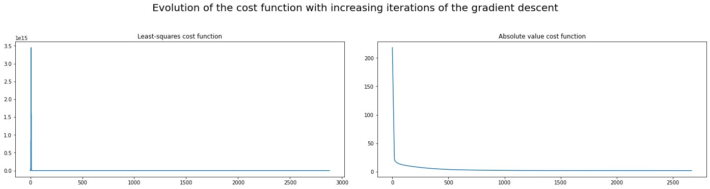
    


    
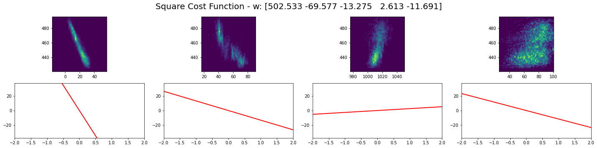
    


    
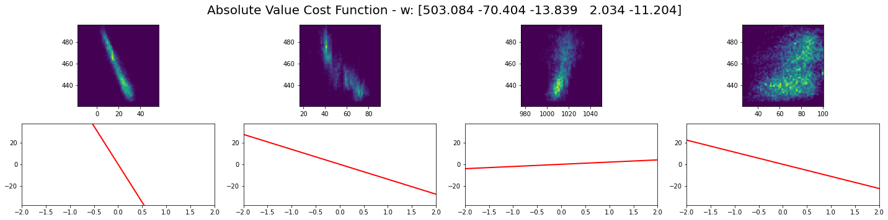
    


## Part II: Linear Regression using Scikit Learn

To use scikit-learn's linear regression model, we simply scale our features using the fit_transform method of a MinMaxScaler instance (from the sklearn.preprocessing module) and create an instance of the LinearRegression class from the linear_model module.

Since the dataset contains a number of samples orders of magnitude greater than columns, it is unnecessary to train and test the model on differents subsets of the dataset.

To retrieve the bias and the weights, we get the intercept_ and coef_ attributes from our LinearRegression instance. We create a function to display the statistics of our linear regression (errors & weights).

We obtain the same result with scikit-learn as with our linear regression implementation from scratch; with an R squared of 0.93, we see that we predict the model very accurately.


```python
def linear_regression_stats(w, X, y, y_pred, columns, title="Linear Regression", X_display=False):
    print("Weights:", len(w), "components")
    print()
    
    dict_w = dict(zip(["Bias"] + list(columns), w))
    print("Coefficients:")
    
    for k, v in dict_w.items():
        print(f'{k:<20} {v}')
    
    print()
    print("Mean absolute error: %.2f"
          % mean_absolute_error(y, y_pred))

    print("Root mean squared error: %.2f"
          % mean_squared_error(y, y_pred, squared=False))

    print("Coefficient of determination: %.2f"
          % r2_score(y, y_pred))
    
    if(X_display is not False):
        plot_weights_data_biasless(plt, X_display, y, w, title)
    
    
    return
```


```python
def linear_regression_sklearn(path, y_label):
    X, y, df = load_data_excel(path, y_label)

    scaler = MinMaxScaler()
    X_normalized = scaler.fit_transform(X)

    model = linear_model.LinearRegression()
    model.fit(X_normalized, y)
    
    linear_regression_stats([model.intercept_] + list(model.coef_), X_normalized, y,
                            model.predict(X_normalized), df.drop(y_label, axis=1).columns, "Scikit Learn Linear Regression", X)
    
    return X, w, y, df
```


```python
X, w, y, df = linear_regression_sklearn("powerplant.xlsx", "PE")
```

    Weights: 5 components
    
    Coefficients:
    Bias                 502.69952629563875
    AT                   -69.80621266422945
    V                    -13.146102949136466
    AP                   2.508771758184392
    RH                   -11.790836077564483
    
    Mean absolute error: 3.63
    Root mean squared error: 4.56
    Coefficient of determination: 0.93


    
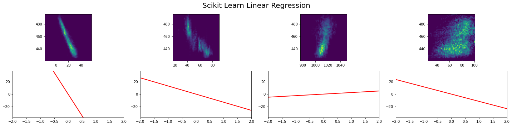
    


## Part III: Linear Regression using the Normal Equation (from scratch)

In this part, we code all the basic linear algebra functions to calculate our normal equation from scratch.


```python
h = lambda x, w: [sum(column*weight) for column, weight in line for line in zip(x, w)]

def transposeMatrix(m):
    return list(map(list,zip(*m)))

def createOnesVector(n):
    vector = []
    for i in range(n):
        vector.append(1)
    
    return vector

def normalizeFeaturesMatrix(X):
    X_t = transposeMatrix(X)
    for column in X_t:
        maximum = max(column)
        minimum = min(column)
        
        for i in range(len(column)):
            column[i] = (column[i] - minimum)/(maximum-minimum)
    
    first_column = createOnesVector(len(X))
    X_t.insert(0, first_column)
    
    return transposeMatrix(X_t)

def productMatrix(X, Y):
    #print("(", len(X), ",", len(X[0]), "), (", len(Y), ",", len(Y[0]), ")")
    result = []
    for i in range(len(Y)):
       if isinstance(Y[i], (int, float)):
           Y[i] = [Y[i]]
           
    for i in range(len(X)):
       if isinstance(X[i], (int, float)):
           X[i] = [X[i]]
           
    for i in range(len(X)):
        result.append([])
        for j in range(len(Y[0])):
            result[i].append(0)
    
    # iterate through rows of X    
           
    for i in range(len(X)):
       # iterate through columns of Y
       for j in range(len(Y[0])):
           # iterate through rows of Y
           for k in range(len(Y)):
               result[i][j] += X[i][k] * Y[k][j]

    return result    

def getMatrixMinor(m,i,j):
    return [row[:j] + row[j+1:] for row in (m[:i]+m[i+1:])]

def getMatrixDeterminant(m):
    #base case for 2x2 matrix
    if len(m) == 2:
        return m[0][0]*m[1][1]-m[0][1]*m[1][0]

    determinant = 0
    for c in range(len(m)):
        determinant += ((-1)**c)*m[0][c]*getMatrixDeterminant(getMatrixMinor(m,0,c))
    return determinant

def getMatrixInverse(m):
    determinant = getMatrixDeterminant(m)
    #special case for 2x2 matrix:
    if len(m) == 2:
        return [[m[1][1]/determinant, -1*m[0][1]/determinant],
                [-1*m[1][0]/determinant, m[0][0]/determinant]]

    #find matrix of cofactors
    cofactors = []
    for r in range(len(m)):
        cofactorRow = []
        for c in range(len(m)):
            minor = getMatrixMinor(m,r,c)
            cofactorRow.append(((-1)**(r+c)) * getMatrixDeterminant(minor))
        cofactors.append(cofactorRow)
    cofactors = transposeMatrix(cofactors)
    for r in range(len(cofactors)):
        for c in range(len(cofactors)):
            cofactors[r][c] = cofactors[r][c]/determinant
    return cofactors
```

We apply the normal equation formula ( (X_t * X)^-1 * (X_t * y) ) and then display the obtained weights.


```python
def linear_regression_normal_equation(path, y_label):
    
    X, y, df = load_data_excel(path, y_label)

    X_normalized = normalizeFeaturesMatrix(X)
    X_t = transposeMatrix(X_normalized)

    w = productMatrix (
            getMatrixInverse (
                productMatrix(X_t, X_normalized)
            ), 
                productMatrix(X_t, list(y))
        )

    linear_regression_stats(w, X_normalized, y, productMatrix(X_normalized, w),
                            df.drop(y_label, axis=1).columns, "Linear Regression Using the Normal Equation", X)
    
    return X, w, y, df
```

There are almost the same as before, and just like with scikit-learn, we obtain an R squared of 0.93, meaning our previous implementations were correct (for a small number of features, the normal equation predicts the exact optimal weights for the global minimum of the cost function).


```python
X, w, y, df = linear_regression_normal_equation("powerplant.xlsx", "PE")
```

    Weights: 5 components
    
    Coefficients:
    Bias                 [502.69952629770523]
    AT                   [-69.80621266353046]
    V                    [-13.1461029532893]
    AP                   [2.508771759332376]
    RH                   [-11.790836079060682]
    
    Mean absolute error: 3.63
    Root mean squared error: 4.56
    Coefficient of determination: 0.93


    
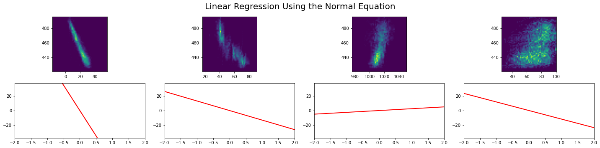
    


# Second Dataset: Analysis & Model Fitting of the Bike Sharing Dataset

The original dataset can found at: https://archive.ics.uci.edu/ml/datasets/Bike+Sharing+Dataset. The modified dataset can be found in the same project folder as the notebook. It has 12 feature columns and one output column ("demand", corresponding to "cnt" in the original dataset).

We hardcode our dataset loading with a custom function that replaces the dayOfWeek column (a string column) with an integer column, corresponding to the index of the day in a week.


```python
def load_bike_data():
    df = pd.read_csv("Bike Rental UCI dataset.csv")

    days_dict = {"Mon": 0, "Tue": 1, "Wed": 2, "Thr": 3, "Fri": 4, "Sat": 5, "Sun": 6}
    df['dayOfWeek'] = df['dayOfWeek'].map(days_dict)

    y = df['demand'].to_numpy()
    X = df.drop('demand', axis=1).to_numpy()
    
    return X, y, df
```

We display the intercorrelations of our columns to get some insights about each feature. As we can see, the hour of the day (hr), the temperature (temp), the year (yr) and "workingday" (indicated whether the day is a working day) have the highest correlations with our output column (demand).

Most other columns have a high intercorrelation with the previously described variables, meaning they do not carry more information than those variables (i.e. a PCA would probably only contain variables very similar to those 4 described, and not lose information).


```python
def heatmap_correlations():
    X, y, df = load_bike_data()
    corr = df.corr()
    sns.heatmap(corr, mask=np.zeros_like(corr, dtype=np.bool), cmap=sns.diverging_palette(220, 10, as_cmap=True), square=True)
```


```python
heatmap_correlations()
```


    
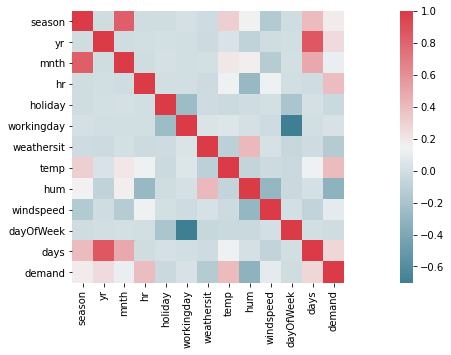
    


## Part I: Raw Linear Regression

We reuse the same functions/logic as before to implement the linear regressions for the bike sharing dataset.


```python
def linear_regression_from_scratch_bike():
    
    X, y, df = load_bike_data()

    X_t = X.T

    w = np.random.randint(-10, 10, 13)
    X_normalized = normalizeFeatures(X)

    all_results = []
    for func in ["squares", "absolute"]:
        print(func.capitalize(), "Cost Function Gradient Descent:\n")
        results = gradientDescent(20, w.copy(), X_normalized, y, 100000, 0.000001, 5000, 10, func)
        all_results.append(results)
        
        print()
        print("Initial weights: ", w, "\n")
        print(func.capitalize(), "cost function:")
        
        print("Execution time: %.2f ms" % results[1])
        print("Final w: ", results[0])
        print("Iterations: ", results[3])
        print("Score: %.2f (%s)" % (results[4], func.capitalize()))
    
        print()
        print("Mean Absolute Error: %.2f (from scratch), %.2f (sklearn)" % ( meanAbsoluteError(X_normalized, results[0], y),
                                                                             mean_absolute_error(y, X_normalized @ results[0]) ))
        print("Root Mean Squared Error: %.2f (from scratch), %.2f (sklearn)" % ( rootMeanSquaredError(X_normalized, results[0], y),
                                                                                 mean_squared_error(y, X_normalized @ results[0], squared=False) ))
        print("R2 Score: %.2f (from scratch), %.2f (sklearn)" % ( r2(X_normalized, results[0], y),
                                                                  r2_score(y, X_normalized @ results[0]) ))
        
        print()

    fig, ((ax1, ax2)) = plt.subplots(1, 2)
    ax1.plot(np.linspace(0, all_results[0][3], all_results[0][3]), all_results[0][2])
    ax1.set_title("Least-squares cost function")
    ax2.plot(np.linspace(0, all_results[1][3], all_results[1][3]), all_results[1][2])
    ax2.set_title("Absolute value cost function")
    fig.tight_layout(pad=3.0)
    
    fig.suptitle("Evolution of the cost function with increasing iterations of the gradient descent", fontsize=20, y=1.08)
    
    return X, w, y, df
```


```python
X, w, y, df = linear_regression_from_scratch_bike()
```

    Squares Cost Function Gradient Descent:
    
     curr iter                          cost difference                                curr cost                alpha
    
             0                                      N/A                       121659735.64936265                   20
             1                       -682631310246.5522                        682752969982.2017                   20
             2                        516590940635.4426                       166162029346.75903                 10.0
             3                      -226810645234880.22                       226976807264226.97                 10.0
             4                        173261688677657.2                       53715118586569.766                  5.0
             5                   -1.731074826973887e+16                    1.736446338832544e+16                  5.0
             6                   1.3492809590313912e+16                       3871653798011528.5                  2.5
             7                  -2.7518764142379082e+17                   2.7905929522180234e+17                  2.5
             8                   2.2476143688496307e+17                    5.429785833683928e+16                 1.25
             9                   -7.072003472848874e+17                    7.614982056217267e+17                 1.25
          5000                    6.082581967348233e-05                       10077.717266576661               0.3125
         10000                   4.4551748942467384e-05                       10077.455938695417               0.3125
         15000                    3.263184044044465e-05                       10077.264529598391               0.3125
         20000                   2.3901129679870792e-05                        10077.12433237852               0.3125
         25000                   1.7506334188510664e-05                       10077.021645198207               0.3125
         30000                   1.2822481949115172e-05                       10076.946432173221               0.3125
         35000                    9.391800631419756e-06                       10076.891342539737               0.3125
         40000                    6.879005013615824e-06                       10076.850992245116               0.3125
         45000                    5.038513336330652e-06                       10076.821437750503               0.3125
         50000                    3.690453013405204e-06                       10076.799790618552               0.3125
         55000                   2.7030637284042314e-06                       10076.783935218968               0.3125
         60000                    1.979853550437838e-06                       10076.772321962459               0.3125
         65000                   1.4501401892630383e-06                       10076.763815855375               0.3125
         70000                   1.0621533874655142e-06                       10076.757585573827               0.3125
    
    Weights found:  [  12.51829849   60.16669988  122.54362647   38.08757806  177.15381025
      -24.37336467    4.51867719  -11.43225619  277.20917373 -196.86191403
       25.31465646    1.02458142  -82.59791542]
    
    Initial weights:  [-6 -1 -6 -7 -6 -7 -8  9  8  4  0 -2  9] 
    
    Squares cost function:
    Execution time: 8641.69 ms
    Final w:  [  12.518   60.167  122.544   38.088  177.154  -24.373    4.519  -11.432
      277.209 -196.862   25.315    1.025  -82.598]
    Iterations:  70970
    Score: 10076.76 (Squares)
    
    Mean Absolute Error: 106.10 (from scratch), 106.10 (sklearn)
    Root Mean Squared Error: 141.96 (from scratch), 141.96 (sklearn)
    R2 Score: 0.39 (from scratch), 0.39 (sklearn)
    
    Absolute Cost Function Gradient Descent:
    
     curr iter                          cost difference                                curr cost                alpha
    
             0                                      N/A                         84.7415555211802                   20
             1                       6.3979644561783715                        78.34359106500183                   20
             2                        4.163250083668885                        74.18034098133295                   20
             3                        2.957257172789298                        71.22308380854365                   20
             4                        2.125628686841594                        69.09745512170205                   20
             5                       1.4810254846058228                        67.61642963709623                   20
             6                       1.0403776961439348                         66.5760519409523                   20
             7                        0.749237887956042                        65.82681405299626                   20
             8                       0.5365400483247669                        65.29027400467149                   20
             9                      0.39928615047901417                        64.89098785419247                   20
    
    Weights found:  [ 1.26477933e+01  3.76727276e+01  3.81947178e+01 -9.71592151e+00
      1.77467353e+02 -4.80654813e+00  3.03814949e-02  7.81542858e+00
      2.28484869e+02 -1.79847494e+02  2.53318502e+00  1.77481635e+01
      2.51941160e+01]
    
    Initial weights:  [-6 -1 -6 -7 -6 -7 -8  9  8  4  0 -2  9] 
    
    Absolute cost function:
    Execution time: 585.64 ms
    Final w:  [ 1.26480e+01  3.76730e+01  3.81950e+01 -9.71600e+00  1.77467e+02
     -4.80700e+00  3.00000e-02  7.81500e+00  2.28485e+02 -1.79847e+02
      2.53300e+00  1.77480e+01  2.51940e+01]
    Iterations:  2952
    Score: 50.58 (Absolute)
    
    Mean Absolute Error: 101.16 (from scratch), 101.16 (sklearn)
    Root Mean Squared Error: 147.69 (from scratch), 147.69 (sklearn)
    R2 Score: 0.34 (from scratch), 0.34 (sklearn)
    


    

    


```python
def linear_regression_scikit_bike():
    X, y, df = load_bike_data()

    scaler = MinMaxScaler()
    X_normalized = scaler.fit_transform(X)

    model = linear_model.LinearRegression()
    model.fit(X_normalized, y)

    
    linear_regression_stats([model.intercept_] + list(model.coef_), X_normalized, y,
                            model.predict(X_normalized), df.drop("demand", axis=1).columns,
                            "Scikit Learn Linear Regression (Bike Sharing Dataset)")
    
    return X, w, y, df
```


```python
X, w, y, df = linear_regression_scikit_bike()
```

    Weights: 13 components
    
    Coefficients:
    Bias                 12.70222800138481
    season               60.136022510799975
    yr                   130.00364157932958
    mnth                 44.9430599627203
    hr                   177.1774698565802
    holiday              -24.386075025499807
    workingday           4.517243675373237
    weathersit           -11.450442809762603
    temp                 277.2098848446928
    hum                  -196.8266250443891
    windspeed            25.33532207207788
    dayOfWeek            1.0187825756877227
    days                 -97.41800717998706
    
    Mean absolute error: 106.09
    Root mean squared error: 141.96
    Coefficient of determination: 0.39


```python
def linear_regression_normal_equation_bike():
    X, y, df = load_bike_data()
    
    X_normalized = normalizeFeatures(X)
    X_train, X_test, y_train, y_test = train_test_split(X_normalized, y, random_state = 1, test_size=0.2)

    start = time.time() * 1000

    w = np.dot(np.linalg.inv(np.dot(X_train.T, X_train)), np.dot(X_train.T, y_train))
    print(len(w))
    
    end = time.time() * 1000
    
    
    linear_regression_stats(w, X_normalized, y_test, X_test @ w,
                            df.drop("demand", axis=1).columns,
                            "Linear Regression Using the Normal Equation (Bike Sharing Dataset)")
    
    return X, w, y, df
```


```python
X, w, y, df = linear_regression_normal_equation_bike()
```

    13
    Weights: 13 components
    
    Coefficients:
    Bias                 15.079934916228012
    season               59.339308082236016
    yr                   138.8077656327514
    mnth                 55.21086379577173
    hr                   175.21107201612472
    holiday              -27.156028085155583
    workingday           5.675966661051689
    weathersit           -12.155998101331193
    temp                 276.5409816263464
    hum                  -198.53619282883324
    windspeed            20.51289595746175
    dayOfWeek            1.864165235446272
    days                 -116.36340328166261
    
    Mean absolute error: 106.45
    Root mean squared error: 141.72
    Coefficient of determination: 0.40


## Part II: Data Exploration

The normal equation is slightly more effective than the linear regression, but overrall, the R squared coefficient found (0.4) is very mediocre. This is likely due to the fact that our hr, yr, weathersit and season columns are treated as integer columns (with values increasing in an ascending order), even though there is no logical order relationship between the different states of those variables; if it was sure that there was a predefined linear relationship between the hour of the day and the demand, we could reorganize the values so that each ascending value corresponds to a time of day where there is linearly more demand. However, we will surely need to reengineer our variables in another way. We can visualize the difference between the predicted values of our linear model and the actual values by aggregating over our different "cyclical"/bianry columns.


```python
def data_exploration_bike():
    X, y, df = load_bike_data()
    
    w = np.dot(np.linalg.inv(np.dot(X.T, X)), np.dot(X.T, y))
    y_pred = X @ w
    df['demand_pred'] = y_pred
    
    print('Coefficient of determination: %.2f'
      % r2_score(y, y_pred))
    
    print(len(df))
    print("Ten random samples from the dataset:\n")
    print(df.sample(10).head(10))
    
    
    cyclical_columns = ['season', 'weathersit', 'hr', 'dayOfWeek', 'workingday', 'holiday', 'yr']
    
    for feature in cyclical_columns:
        df_agg = df.groupby(feature).agg(["mean", "median", "var"])
        
        print("\n")
        print(df_agg[["demand", "demand_pred"]].head(10))
        
        bar_width = 0.3
        fig, axs = plt.subplots(1, len(df_agg["demand"].columns))
        
        for i, column in enumerate(df_agg["demand"].columns):
        
            axs[i].bar(df_agg.index - bar_width/2, df_agg["demand"][column], bar_width, label='y true')
            axs[i].bar(df_agg.index + bar_width/2, df_agg["demand_pred"][column], bar_width, label='y predicted')   
            axs[i].legend()
            axs[i].set_title(column, fontsize=20)

            axs[i].set_xticks(df_agg.index)

        fig.suptitle(feature + ": comparison between truth and prediction", fontsize=20, y=1.08)

```


```python
data_exploration_bike()
```

    Coefficient of determination: 0.39
    17379
    Ten random samples from the dataset:
    
           season  yr  mnth  hr  holiday  workingday  weathersit  temp   hum  windspeed  dayOfWeek  days  demand  demand_pred
    17170       1   1    12   5        0           0           1  0.20  0.51     0.0000          6   715       6    85.025237
    7001        4   0    10   8        0           1           2  0.42  0.88     0.1642          0   291     398    78.793690
    8703        1   1     1  11        0           1           1  0.18  0.37     0.5224          1   362      75   172.166678
    13250       3   1     7   7        0           1           2  0.66  0.83     0.1045          2   552     497   207.431984
    3733        2   0     6  11        0           1           1  0.90  0.42     0.2239          3   155     118   294.353753
    13939       3   1     8   0        0           1           1  0.72  0.74     0.1940          3   580      67   194.785484
    6604        4   0    10  18        0           1           1  0.56  0.60     0.0896          4   275     465   251.815248
    309         1   0     1   9        0           1           1  0.14  0.69     0.1343          4    12     117   -12.088177
    1747        1   0     3  12        0           1           2  0.56  0.49     0.3582          4    72     195   170.719507
    16146       4   1    11  12        0           0           1  0.48  0.48     0.0000          5   672     606   284.064723
    
    
                demand                      demand_pred                          
                  mean median           var        mean      median           var
    season                                                                       
    1       111.114569   76.0  14214.364612  115.323382  113.846535   9681.434205
    2       208.344069  165.0  35480.421290  193.216813  191.006952  11559.868944
    3       236.016237  199.0  39089.888724  256.884292  256.776445  10180.924440
    4       198.868856  155.5  33477.278708  189.066755  192.242005   9110.694564
    
    
                    demand                      demand_pred                          
                      mean median           var        mean      median           var
    weathersit                                                                       
    1           204.869272    159  35905.616277  207.843434  209.899623  12795.372589
    2           175.165493    133  27367.610731  162.502963  161.305560  10449.299623
    3           111.579281     63  17897.368005  130.773596  127.849197  10234.572738
    4            74.333333     36   6072.333333   26.230515    8.534965   5804.181395
    
    
            demand                      demand_pred                         
              mean median           var        mean      median          var
    hr                                                                      
    0    53.898072   40.0   1789.959251   79.768812   85.645790  6001.016718
    1    33.375691   20.0   1124.846213   82.330754   86.826823  5836.261474
    2    22.869930   11.0    706.424235   86.600493   90.410902  5629.431896
    3    11.727403    6.0    175.276159   91.796335   95.027733  5295.320865
    4     6.352941    6.0     17.171231   95.971317   98.929092  5150.567641
    5    19.889819   19.0    174.260189   98.941965  102.702225  5278.485291
    6    76.044138   76.0   3034.285342  104.598016  107.906228  5393.408450
    7   212.064649  208.0  26063.498570  116.632991  119.821555  5866.947018
    8   359.011004  385.0  55313.999879  134.790530  136.095544  6612.168659
    9   219.309491  216.0   8780.337968  157.124994  158.203789  7065.198644
    
    
                   demand                      demand_pred                          
                     mean median           var        mean      median           var
    dayOfWeek                                                                       
    0          183.744655    139  32225.336306  185.872767  185.649440  12337.375341
    1          191.238891    147  35276.532630  193.463066  191.586918  12160.702330
    2          191.130505    143  36440.696381  190.153178  186.061785  13269.690070
    3          196.436665    154  35348.483335  197.400976  195.325764  12521.061083
    4          196.135907    165  30302.765110  191.835377  189.328695  13197.053107
    5          190.209793    129  32335.437053  184.625748  182.947089  13147.820909
    6          177.468825    116  28280.378676  184.473269  182.196525  11919.571627
    
    
                    demand                     demand_pred                          
                      mean median          var        mean      median           var
    workingday                                                                      
    0           181.405332    119  29878.44714  182.039717  180.097217  12510.035810
    1           193.207754    151  34264.77789  193.207754  191.649945  12702.653684
    
    
                demand                      demand_pred                          
                  mean median           var        mean      median           var
    holiday                                                                      
    0        190.42858    144  33117.242662  190.635819  188.930652  12666.995484
    1        156.87000     97  24572.906914  156.870000  153.336933  11612.077618
    
    
            demand                      demand_pred                          
              mean median           var        mean      median           var
    yr                                                                       
    0   143.794448    109  17901.865772  144.199074  141.809477  10569.671592
    1   234.666361    191  43643.781264  234.666361  231.637790  10674.391873


    
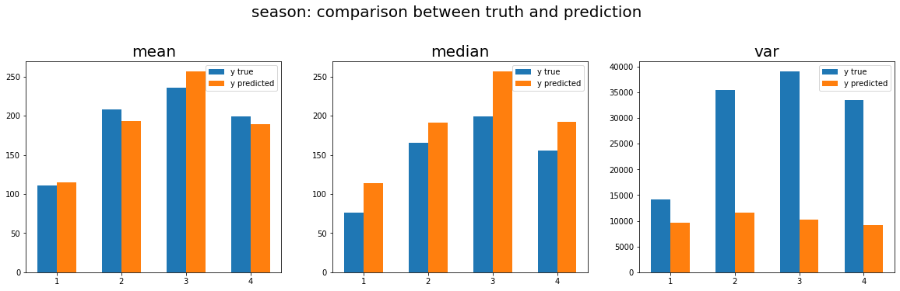
    


    
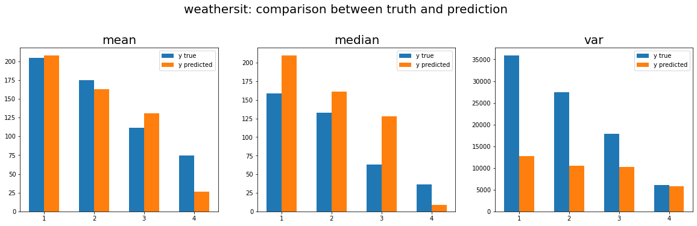
    


    
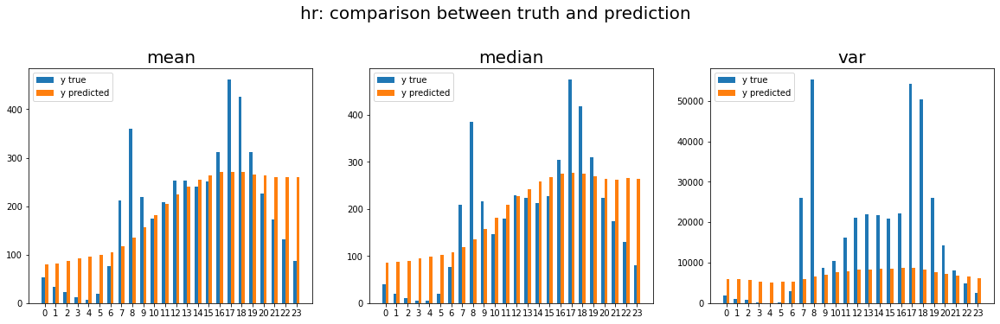
    


    
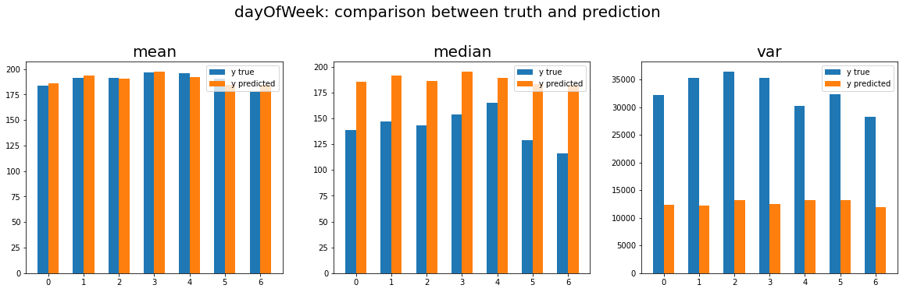
    


    
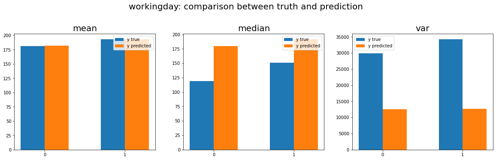
    


    
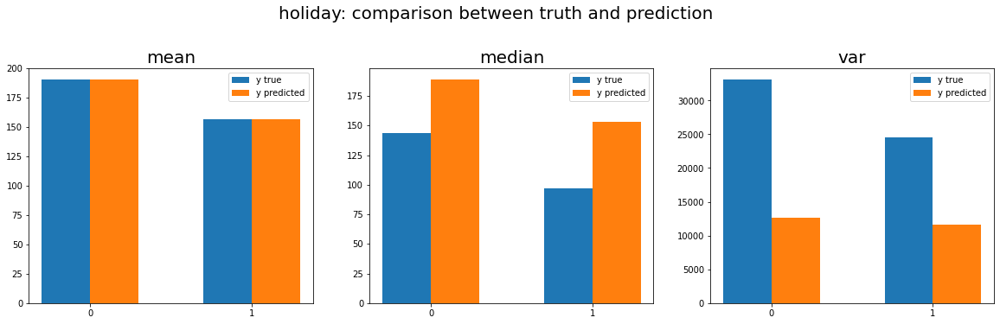
    


    
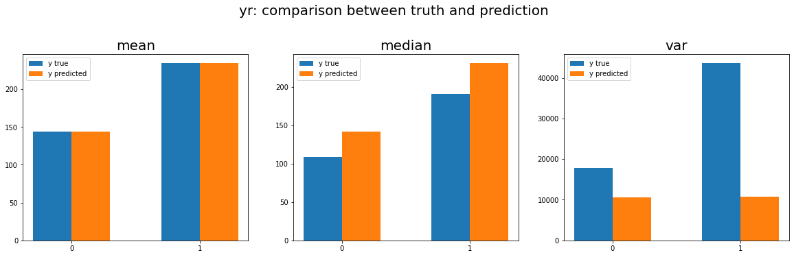
    


As we can see, the variance of each variable is very badly estimated by our model, and the mean for the demand depending on the hour of day column (hr) is especially incorrectly predicted; assuring that our model can acurately predict the demand depending on the hour is critcal to having a good R squared coefficient, as the hr column is highly correlated with the demand. To find how important the hr column is to predicting the demand, we will try different models.

## Part III: Model Testing

First, we implement a model with only the temp variable (the non-categorical column the most correlated to our demand).


```python
def model_temp_only():
    X, y, df = load_bike_data()

    df = df[["temp", "demand"]]

    y = df["demand"].to_numpy()
    X = df.drop("demand", axis=1).to_numpy()

    scaler = MinMaxScaler()
    X_normalized = scaler.fit_transform(X)

    model = linear_model.LinearRegression()
    model.fit(X_normalized, y)

    linear_regression_stats([model.intercept_] + list(model.coef_), X_normalized, y,
                            model.predict(X_normalized), df.drop("demand", axis=1).columns,
                            "Scikit Learn Linear Regression (Bike Sharing Dataset - temp only)")
    
    return X, w, y, df
```


```python
X, w, y, df = model_temp_only()
```

    Weights: 2 components
    
    Coefficients:
    Bias                 7.590302332541086
    temp                 373.6690238139917
    
    Mean absolute error: 125.52
    Root mean squared error: 165.86
    Coefficient of determination: 0.16


Temperature alone is enough to describe demand with a 0.16 R squared. Now, let us try to see how relevant hour is on its own by one-hot encoding the variable in the dataset. This will create 24 variables, each corresponding to one hour of the day; since hour is the variable most correlated to our output variable, this is sure to be effective.


```python
def model_hour_only():
    X, y, df = load_bike_data()

    hour = pd.get_dummies(df.hr, prefix="hr")
    df = pd.concat([df["demand"], hour], axis=1)

    y = df["demand"].to_numpy()
    X = df.drop("demand", axis=1).to_numpy()

    scaler = MinMaxScaler()
    X_normalized = scaler.fit_transform(X)

    model = linear_model.LinearRegression()
    model.fit(X_normalized, y)

    linear_regression_stats([model.intercept_] + list(model.coef_), X_normalized, y,
                            model.predict(X_normalized), df.drop("demand", axis=1).columns,
                            "Scikit Learn Linear Regression (Bike Sharing Dataset - hour only)")

    return X, w, y, df
```


```python
X, w, y, df = model_hour_only()
```

    Weights: 25 components
    
    Coefficients:
    Bias                 374371697728217.06
    hr_0                 -374371697728163.7
    hr_1                 -374371697728183.25
    hr_2                 -374371697728196.94
    hr_3                 -374371697728204.44
    hr_4                 -374371697728210.6
    hr_5                 -374371697728195.8
    hr_6                 -374371697728140.94
    hr_7                 -374371697728005.2
    hr_8                 -374371697727857.2
    hr_9                 -374371697727997.1
    hr_10                -374371697728043.6
    hr_11                -374371697728008.0
    hr_12                -374371697727964.0
    hr_13                -374371697727963.0
    hr_14                -374371697727976.2
    hr_15                -374371697727965.4
    hr_16                -374371697727905.25
    hr_17                -374371697727756.44
    hr_18                -374371697727791.8
    hr_19                -374371697727905.2
    hr_20                -374371697727991.44
    hr_21                -374371697728044.8
    hr_22                -374371697728086.06
    hr_23                -374371697728129.4
    
    Mean absolute error: 88.08
    Root mean squared error: 128.07
    Coefficient of determination: 0.50


The hr variable has a R squared score of 0.5 on its own ! This means that it carries most of the information of our dataset, and even more information that could be deduced from the correlation itself. Next we will test a model with all variables one-hot encoded (except days, as it would clearly overfit our data, since there would be one variable for every day, so the number of individuals to number of variables ratio would only be of 1/24, which is way too high.

Also as we can see, the weights have strange large values; this is due to the fact that with one-hot encoding, since it is sure that one and only one of the variables will be "on" at any given time, the bias can take any value, since the weights on the variables can correct it back to the "real" bias value. With multiple categorical variables being one-hot encoded, the same can happen again, as one variable of each one-hot encoded variable is sure to be 1 at any given time, the weights from one variable can derive from their original value as long as it is corrected by the other variable. Thus, from now on, the coefficients of the values will not be analysable.


```python
def model_all_variables():
    X, y, df = load_bike_data()
    
    season = pd.get_dummies(df.season, prefix="season")
    month = pd.get_dummies(df.mnth, prefix="mnth")
    year = pd.get_dummies(df.yr, prefix="yr")
    workingday = pd.get_dummies(df.workingday, prefix="workingday")
    dayOfWeek = pd.get_dummies(df.dayOfWeek, prefix="dayOfWeek")
    holiday = pd.get_dummies(df.holiday, prefix="holiday")
    weather = pd.get_dummies(df.weathersit, prefix="weather_state")
    hour = pd.get_dummies(df.hr, prefix="hr")
    
    df = pd.concat([df[["temp", "hum", "windspeed", "demand"]], season, month, year, workingday,
                    weather, dayOfWeek, holiday, hour], axis=1)
    
    y = df["demand"].to_numpy()
    X = df.drop("demand", axis=1).to_numpy()

    scaler = MinMaxScaler()
    X_normalized = scaler.fit_transform(X)

    model = linear_model.LinearRegression()
    model.fit(X_normalized, y)

    linear_regression_stats([model.intercept_] + list(model.coef_), X_normalized, y,
                            model.predict(X_normalized), df.drop("demand", axis=1).columns,
                            "Scikit Learn Linear Regression (Bike Sharing Dataset - all variables)")
    
    return X, w, y, df
```


```python
X, w, y, df = model_all_variables()
```

    Weights: 61 components
    
    Coefficients:
    Bias                 -3287449034800647.5
    temp                 229.47279613872115
    hum                  -82.84376702764325
    windspeed            -30.467239847406844
    season_1             93204320900616.83
    season_2             93204320900656.0
    season_3             93204320900648.75
    season_4             93204320900684.06
    mnth_1               107485739536674.39
    mnth_2               107485739536678.69
    mnth_3               107485739536689.56
    mnth_4               107485739536680.4
    mnth_5               107485739536692.92
    mnth_6               107485739536677.94
    mnth_7               107485739536658.33
    mnth_8               107485739536678.67
    mnth_9               107485739536704.48
    mnth_10              107485739536690.25
    mnth_11              107485739536665.47
    mnth_12              107485739536668.36
    yr_0                 1577210655215961.0
    yr_1                 1577210655216045.0
    workingday_0         1531539644338810.8
    workingday_1         -17779893992024.58
    weather_state_1      22423555517236.812
    weather_state_2      22423555517226.04
    weather_state_3      22423555517171.22
    weather_state_4      22423555517172.402
    dayOfWeek_0          783327032305122.9
    dayOfWeek_1          783327032305123.9
    dayOfWeek_2          783327032305127.2
    dayOfWeek_3          783327032305125.9
    dayOfWeek_4          783327032305130.5
    dayOfWeek_5          -765992506025705.1
    dayOfWeek_6          -765992506025721.8
    holiday_0            832832862605260.6
    holiday_1            -716486675725601.2
    hr_0                 -111255237288266.38
    hr_1                 -111255237288282.67
    hr_2                 -111255237288292.25
    hr_3                 -111255237288303.0
    hr_4                 -111255237288305.0
    hr_5                 -111255237288288.69
    hr_6                 -111255237288230.12
    hr_7                 -111255237288094.53
    hr_8                 -111255237287954.88
    hr_9                 -111255237288102.25
    hr_10                -111255237288157.12
    hr_11                -111255237288130.94
    hr_12                -111255237288093.22
    hr_13                -111255237288097.62
    hr_14                -111255237288113.88
    hr_15                -111255237288104.5
    hr_16                -111255237288042.69
    hr_17                -111255237287888.69
    hr_18                -111255237287920.23
    hr_19                -111255237288028.42
    hr_20                -111255237288108.75
    hr_21                -111255237288157.62
    hr_22                -111255237288194.47
    hr_23                -111255237288233.38
    
    Mean absolute error: 75.11
    Root mean squared error: 101.65
    Coefficient of determination: 0.69


With all the variables in our datasets, we obtain a R squared coefficient of 0.69, which is pretty mediocre, but seems to be the maximum that can be attained using a linear model. However, we observe that we have 61 components to our weights (39 more than with just the hour), for only 0.19 gained on our R2. We will try to trim down our model to have the optimal R2/number of variables ratio.

To remove variables, we can think logically: workingday contains most of the relevant information of week days (since what differentiates weeks days from the weekend is whether they are days of work, and it is improbable that consumer habits would change drastically in between week days), we can drop dayOfWeek and holiday (because there are very few days that are non-working and are not holidays). Also, most of the information of month is carried in season (which is also mostly contained in weather and tempature, as they are the most correlated on the correlation heatmap, but logically because what mostly change in between months is the climate) and year (as it describes long term changes in consumer tendencies), so we will drop the mnth column. 


```python
def model_all_variables_trimmed():
    X, y, df = load_bike_data()
    
    print(df.columns)
    season = pd.get_dummies(df.season, prefix="season")
    year = pd.get_dummies(df.yr, prefix="yr")
    workingday = pd.get_dummies(df.workingday, prefix="workingday")
    weather = pd.get_dummies(df.weathersit, prefix="weather_state")
    hour = pd.get_dummies(df.hr, prefix="hr")
    
    df = pd.concat([df[["temp", "hum", "windspeed", "demand"]], season, year, workingday,
                    weather, hour], axis=1)
    
    y = df["demand"].to_numpy()
    X = df.drop("demand", axis=1).to_numpy()

    scaler = MinMaxScaler()
    X_normalized = scaler.fit_transform(X)

    model = linear_model.LinearRegression()
    model.fit(X_normalized, y)

    linear_regression_stats([model.intercept_] + list(model.coef_), X_normalized, y,
                            model.predict(X_normalized), df.drop("demand", axis=1).columns,
                            "Scikit Learn Linear Regression (Bike Sharing Dataset - trimmed model)")
    
    return X, w, y, df
```


```python
X, w, y, df = model_all_variables_trimmed()
```

    Index(['season', 'yr', 'mnth', 'hr', 'holiday', 'workingday', 'weathersit', 'temp', 'hum', 'windspeed', 'dayOfWeek', 'days', 'demand'], dtype='object')
    Weights: 40 components
    
    Coefficients:
    Bias                 31410054584152.043
    temp                 239.13103129069313
    hum                  -70.11770358086514
    windspeed            -28.73115471762346
    season_1             -54953805315583.93
    season_2             -54953805315540.43
    season_3             -54953805315555.62
    season_4             -54953805315517.93
    yr_0                 26837883695852.93
    yr_1                 26837883695938.3
    workingday_0         1152526478866.2336
    workingday_1         1152526478873.348
    weather_state_1      -4313108840646.7466
    weather_state_2      -4313108840657.415
    weather_state_3      -4313108840712.563
    weather_state_4      -4313108840714.447
    hr_0                 -133550602716.63249
    hr_1                 -133550602734.13013
    hr_2                 -133550602743.27393
    hr_3                 -133550602753.81503
    hr_4                 -133550602757.17523
    hr_5                 -133550602740.45392
    hr_6                 -133550602681.51718
    hr_7                 -133550602546.36156
    hr_8                 -133550602405.72298
    hr_9                 -133550602553.23534
    hr_10                -133550602607.84065
    hr_11                -133550602582.18098
    hr_12                -133550602542.70438
    hr_13                -133550602547.62059
    hr_14                -133550602563.44862
    hr_15                -133550602554.05779
    hr_16                -133550602492.03513
    hr_17                -133550602338.4451
    hr_18                -133550602370.33269
    hr_19                -133550602479.08385
    hr_20                -133550602558.72362
    hr_21                -133550602608.30258
    hr_22                -133550602645.45706
    hr_23                -133550602684.42998
    
    Mean absolute error: 75.61
    Root mean squared error: 102.51
    Coefficient of determination: 0.68


Despite having removed 21 components to the weight, we have lost almost no information, and the R2 coefficient has only dropped by 0.01. We can try to trim the weight some more. We will remove the humidity (hum) and the wind speed (windspeed) variables from the dataset, as they are almost not correlated with the demand. Also, we will remove the weather column, as the temperature and the season already describe most of the weather changes.


```python
def model_all_variables_most_trimmed():
    X, y, df = load_bike_data()
    
    print(df.columns)
    season = pd.get_dummies(df.season, prefix="season")
    year = pd.get_dummies(df.yr, prefix="yr")
    workingday = pd.get_dummies(df.workingday, prefix="workingday")
    weather = pd.get_dummies(df.weathersit, prefix="weather_state")
    hour = pd.get_dummies(df.hr, prefix="hr")
    
    df = pd.concat([df[["temp", "demand"]], season, year, workingday, hour], axis=1)
    
    y = df["demand"].to_numpy()
    X = df.drop("demand", axis=1).to_numpy()

    scaler = MinMaxScaler()
    X_normalized = scaler.fit_transform(X)

    model = linear_model.LinearRegression()
    model.fit(X_normalized, y)

    linear_regression_stats([model.intercept_] + list(model.coef_), X_normalized, y,
                            model.predict(X_normalized), df.drop("demand", axis=1).columns,
                            "Scikit Learn Linear Regression (Bike Sharing Dataset - most trimmed model)")
    
    return X, w, y, df
```


```python
X, w, y, df = model_all_variables_most_trimmed()
```

    Index(['season', 'yr', 'mnth', 'hr', 'holiday', 'workingday', 'weathersit', 'temp', 'hum', 'windspeed', 'dayOfWeek', 'days', 'demand'], dtype='object')
    Weights: 34 components
    
    Coefficients:
    Bias                 1108457999753337.8
    temp                 253.38856765867126
    season_1             -905497848461046.9
    season_2             -905497848461009.9
    season_3             -905497848461024.1
    season_4             -905497848460986.8
    yr_0                 -186147775733819.84
    yr_1                 -186147775733731.4
    workingday_0         -63785294351338.875
    workingday_1         -63785294351334.02
    hr_0                 46972918792728.74
    hr_1                 46972918792709.484
    hr_2                 46972918792700.08
    hr_3                 46972918792688.24
    hr_4                 46972918792684.21
    hr_5                 46972918792701.87
    hr_6                 46972918792759.45
    hr_7                 46972918792894.46
    hr_8                 46972918793037.2
    hr_9                 46972918792891.93
    hr_10                46972918792839.81
    hr_11                46972918792868.6
    hr_12                46972918792909.39
    hr_13                46972918792905.984
    hr_14                46972918792890.87
    hr_15                46972918792900.09
    hr_16                46972918792961.78
    hr_17                46972918793113.805
    hr_18                46972918793081.04
    hr_19                46972918792971.56
    hr_20                46972918792890.195
    hr_21                46972918792839.76
    hr_22                46972918792801.65
    hr_23                46972918792760.59
    
    Mean absolute error: 77.38
    Root mean squared error: 105.57
    Coefficient of determination: 0.66


6 variables down, and 0.02 lost on the R2 score. Every variable now is critical to our model. We will now create one last model without the year column, as, in the logic of our prediction, this column overfits our dataset; as we saw in the data exploration, the difference in demand between the two years of the dataset is very important, and it doesn't make sense to assume that there is a linear relationship between the year and the demand; since the year is too specific in describing the demand, we remove it from our dataset to avoid overfitting in future predictions.


```python
def model_final():
    X, y, df = load_bike_data()
    
    print(df.columns)
    season = pd.get_dummies(df.season, prefix="season")
    workingday = pd.get_dummies(df.workingday, prefix="workingday")
    weather = pd.get_dummies(df.weathersit, prefix="weather_state")
    hour = pd.get_dummies(df.hr, prefix="hr")
    
    df = pd.concat([df[["temp", "demand"]], season, workingday, hour], axis=1)
    
    y = df["demand"].to_numpy()
    X = df.drop("demand", axis=1).to_numpy()

    scaler = MinMaxScaler()
    X_normalized = scaler.fit_transform(X)

    model = linear_model.LinearRegression()
    model.fit(X_normalized, y)

    linear_regression_stats([model.intercept_] + list(model.coef_), X_normalized, y,
                            model.predict(X_normalized), df.drop("demand", axis=1).columns,
                            "Scikit Learn Linear Regression (Bike Sharing Dataset - final model)")
    
    return X, w, y, df
```


```python
X, w, y, df = model_final()
```

    Index(['season', 'yr', 'mnth', 'hr', 'holiday', 'workingday', 'weathersit', 'temp', 'hum', 'windspeed', 'dayOfWeek', 'days', 'demand'], dtype='object')
    Weights: 32 components
    
    Coefficients:
    Bias                 695432919332540.4
    temp                 284.0390424705157
    season_1             12670818751740.244
    season_2             12670818751768.783
    season_3             12670818751749.348
    season_4             12670818751794.34
    workingday_0         -454697299235976.8
    workingday_1         -454697299235972.2
    hr_0                 -253406438848405.47
    hr_1                 -253406438848423.97
    hr_2                 -253406438848433.1
    hr_3                 -253406438848444.16
    hr_4                 -253406438848447.88
    hr_5                 -253406438848430.97
    hr_6                 -253406438848373.38
    hr_7                 -253406438848238.9
    hr_8                 -253406438848096.7
    hr_9                 -253406438848242.84
    hr_10                -253406438848295.3
    hr_11                -253406438848267.28
    hr_12                -253406438848227.06
    hr_13                -253406438848231.03
    hr_14                -253406438848246.84
    hr_15                -253406438848237.34
    hr_16                -253406438848175.53
    hr_17                -253406438848023.5
    hr_18                -253406438848055.22
    hr_19                -253406438848164.38
    hr_20                -253406438848245.5
    hr_21                -253406438848295.22
    hr_22                -253406438848333.0
    hr_23                -253406438848373.62
    
    Mean absolute error: 82.43
    Root mean squared error: 114.41
    Coefficient of determination: 0.60


Our final model has a coefficient of determination of 0.6, which is pretty mediocre, and cannot be improved much using a linear regression. However, we can use a trick to increase the precision of our linear model by adding a slope variable (containing the tendency of change of demand over the last two hours) and a "memory" of the last demand. Hypothetically, if the bike sharing system has a constant knowledge of the current demand, such predictions of the demand for the next hour could be made in real time, and so this model would make sense in some situations.


```python
def model_absolute():
    X, y, df = load_bike_data()
        
    def coef_dir(df):
        coef_hour=[]

        for i in range (0, np.size(df.to_numpy(),0)):
            if(i>=2):
                coef_hour.append((df['demand'].iloc[i-2]-df['demand'].iloc[i-1])/((i-2)-(i-1)))
                
        df = df.loc[2:, :]
        df.insert(1, 'coef_hour', coef_hour)
        
        return df

    df = coef_dir(df)
    previous_hour = df['demand'].shift(periods=-1)
    df['previous_hour'] = previous_hour
    df = df[:-1]

    season = pd.get_dummies(df.season, prefix="season")
    month = pd.get_dummies(df.mnth, prefix="mnth")
    year = pd.get_dummies(df.yr, prefix="yr")
    workingday = pd.get_dummies(df.workingday, prefix="workingday")
    dayOfWeek = pd.get_dummies(df.dayOfWeek, prefix="dayOfWeek")
    holiday = pd.get_dummies(df.holiday, prefix="holiday")
    weather = pd.get_dummies(df.weathersit, prefix="weather_state")
    hour = pd.get_dummies(df.hr, prefix="hr")
    
    df = pd.concat([df[["temp", "hum", "windspeed", "coef_hour", "previous_hour", "demand"]], season, month, year, workingday,
                    weather, dayOfWeek, holiday, hour], axis=1)

    
    X = df.drop(columns='demand', axis=1)
    
    y = df.demand
    X_train, X_test, y_train, y_test = train_test_split(X, y, random_state = 1, test_size=0.2)

    scaler = MinMaxScaler()
    X_normalized = scaler.fit_transform(X)

    model = linear_model.LinearRegression()
    model.fit(X_normalized, y)

    linear_regression_stats([model.intercept_] + list(model.coef_), X_normalized, y,
                            model.predict(X_normalized), df.drop("demand", axis=1).columns,
                            "Scikit Learn Linear Regression (Bike Sharing Dataset - all variables + slope & memory)")
    
    return X, w, y, df
```


```python
X, w, y, df = model_absolute()
```

    Weights: 63 components
    
    Coefficients:
    Bias                 1253686445631265.2
    temp                 84.62225251644675
    hum                  -41.97547493316782
    windspeed            -11.268458268016047
    coef_hour            394.3025525017671
    previous_hour        640.3950937247846
    season_1             79732366875754.95
    season_2             79732366875768.27
    season_3             79732366875765.58
    season_4             79732366875778.56
    mnth_1               -245848678579735.16
    mnth_2               -245848678579734.03
    mnth_3               -245848678579730.56
    mnth_4               -245848678579734.22
    mnth_5               -245848678579729.0
    mnth_6               -245848678579735.34
    mnth_7               -245848678579741.84
    mnth_8               -245848678579734.16
    mnth_9               -245848678579724.84
    mnth_10              -245848678579730.4
    mnth_11              -245848678579738.25
    mnth_12              -245848678579736.3
    yr_0                 -625341793884164.1
    yr_1                 -625341793884135.1
    workingday_0         -347572509896171.2
    workingday_1         -230581482095599.3
    weather_state_1      -405502991477929.6
    weather_state_2      -405502991477928.94
    weather_state_3      -405502991477940.94
    weather_state_4      -405502991477941.44
    dayOfWeek_0          59888183383197.71
    dayOfWeek_1          59888183383197.4
    dayOfWeek_2          59888183383198.65
    dayOfWeek_3          59888183383198.09
    dayOfWeek_4          59888183383198.69
    dayOfWeek_5          176879211183772.25
    dayOfWeek_6          176879211183768.8
    holiday_0            185148611151709.94
    holiday_1            302139638952273.3
    hr_0                 -71180661004683.75
    hr_1                 -71180661004699.47
    hr_2                 -71180661004707.39
    hr_3                 -71180661004718.14
    hr_4                 -71180661004731.81
    hr_5                 -71180661004756.12
    hr_6                 -71180661004795.53
    hr_7                 -71180661004772.97
    hr_8                 -71180661004566.53
    hr_9                 -71180661004683.94
    hr_10                -71180661004647.5
    hr_11                -71180661004682.75
    hr_12                -71180661004670.38
    hr_13                -71180661004668.16
    hr_14                -71180661004671.94
    hr_15                -71180661004697.47
    hr_16                -71180661004741.94
    hr_17                -71180661004585.66
    hr_18                -71180661004579.31
    hr_19                -71180661004564.11
    hr_20                -71180661004583.12
    hr_21                -71180661004618.6
    hr_22                -71180661004641.0
    hr_23                -71180661004665.97
    
    Mean absolute error: 43.93
    Root mean squared error: 61.68
    Coefficient of determination: 0.88


Using the slope & memory trick, we bump our R2 score to 0.88, which is descent given the fact that we cannot go further than 0.69 with a normal model.

## Part III: Model Testing

Now we will experiment using other models, such as polynomial regression, GBRs & random forests. We will one-hot encode our cyclical variables and ignore the days variable to avoid overfitting.


```python
def model_polynomial():
    X, y, df = load_bike_data()
    
    season = pd.get_dummies(df.season, prefix="season")
    month = pd.get_dummies(df.mnth, prefix="mnth")
    year = pd.get_dummies(df.yr, prefix="yr")
    workingday = pd.get_dummies(df.workingday, prefix="workingday")
    dayOfWeek = pd.get_dummies(df.dayOfWeek, prefix="dayOfWeek")
    holiday = pd.get_dummies(df.holiday, prefix="holiday")
    weather = pd.get_dummies(df.weathersit, prefix="weather_state")
    hour = pd.get_dummies(df.hr, prefix="hr")
    
    df = pd.concat([df[["temp", "hum", "windspeed", "demand"]], season, month, year, workingday,
                    weather, dayOfWeek, holiday, hour], axis=1)
    
    X = df.drop(columns='demand', axis=1).to_numpy()
    y = df.demand

    poly = PolynomialFeatures(2)
    X = poly.fit_transform(X)
    

    X_train, X_test, y_train, y_test = train_test_split(X, y, random_state = 3, test_size=0.2)

    scaler = MinMaxScaler()
    X_normalized = scaler.fit_transform(X)

    model = linear_model.LinearRegression()
    model.fit(X_train, y_train)
    
    # Display only the first 50 weights
    linear_regression_stats([model.intercept_] + list(model.coef_), X_test, y_test,
                            model.predict(X_test), range(50),
                            "Scikit Learn Linear Regression (Bike Sharing Dataset - polynomial regression)") 
    
    return X, w, y, df
```


```python
X, w, y, df = model_polynomial()
```

    Weights: 1892 components
    
    Coefficients:
    Bias                 -565856671135023.1
    0                    453706089558032.0
    1                    398319507516582.9
    2                    -181372203020412.66
    3                    258589399986588.56
    4                    -11037823243591.514
    5                    -3608501313896.939
    6                    244243244573112.25
    7                    397848525626195.94
    8                    -75402447800346.53
    9                    21291592296307.242
    10                   -51923517237322.164
    11                   43199302640342.4
    12                   37203092342100.016
    13                   210847182873706.75
    14                   63141891809257.39
    15                   -19951480979277.707
    16                   -169325747509854.94
    17                   -85105297555445.75
    18                   -89713627792761.56
    19                   105740157073682.77
    20                   -116490748901414.95
    21                   -8689424596687.358
    22                   -146280247331512.6
    23                   -154876916400955.66
    24                   -122875910883698.86
    25                   -148974263940034.22
    26                   -194034388227727.94
    27                   115293342889159.28
    28                   217958024739677.1
    29                   -27912827138339.688
    30                   181876650426477.44
    31                   73538116042012.69
    32                   -26780085388992.645
    33                   312278052859912.56
    34                   -67439632001791.13
    35                   242578555521488.6
    36                   87468711828704.5
    37                   -120667505151661.78
    38                   137334285349085.4
    39                   193224123988364.22
    40                   -386623728423737.2
    41                   -170845739711609.16
    42                   -44082160040824.9
    43                   101355460818762.31
    44                   -119112499595242.2
    45                   -64452405347130.25
    46                   62281811034299.016
    47                   52402963991323.3
    48                   -74300992134451.52
    49                   38700306147340.95
    
    Mean absolute error: 35.27
    Root mean squared error: 51.33
    Coefficient of determination: 0.92


```python
def model_polynomial_bis():
    X, y, df = load_bike_data()
    
    season = pd.get_dummies(df.season, prefix="season")
    month = pd.get_dummies(df.mnth, prefix="mnth")
    workingday = pd.get_dummies(df.workingday, prefix="workingday")
    holiday = pd.get_dummies(df.holiday, prefix="holiday")
    weather = pd.get_dummies(df.weathersit, prefix="weather_state")
    hour = pd.get_dummies(df.hr, prefix="hr")
    
    df = pd.concat([df[["temp", "hum", "windspeed", "demand"]], season, workingday,
                    weather, holiday, hour], axis=1)
    
    X = df.drop(columns='demand', axis=1).to_numpy()
    y = df.demand

    poly = PolynomialFeatures(2)
    X = poly.fit_transform(X)
    

    X_train, X_test, y_train, y_test = train_test_split(X, y, random_state = 3, test_size=0.2)

    scaler = MinMaxScaler()
    X_normalized = scaler.fit_transform(X)

    model = linear_model.LinearRegression()
    model.fit(X_train, y_train)
    
    # Display only the first 50 weights
    linear_regression_stats([model.intercept_] + list(model.coef_), X_test, y_test,
                            model.predict(X_test), range(50),
                            "Scikit Learn Linear Regression (Bike Sharing Dataset - polynomial regression)") 
    
    return X, w, y, df
```


```python
X, w, y, df = model_polynomial_bis()
```

    Weights: 821 components
    
    Coefficients:
    Bias                 250285363322603.88
    0                    1757172700.1106026
    1                    -161228095002373.56
    2                    194363367985306.28
    3                    101372801435767.44
    4                    126894193843493.92
    5                    -21309853473872.03
    6                    299351064352364.06
    7                    46182781640188.984
    8                    -157135021165049.16
    9                    -614589045179921.2
    10                   26835713048362.71
    11                   239268979099876.78
    12                   -158108856339248.38
    13                   -92272212934519.02
    14                   -128942535670618.25
    15                   -83678270714767.89
    16                   -164704576193659.06
    17                   -12201363423435.576
    18                   31322434964663.465
    19                   -18963989827837.28
    20                   29417745491618.613
    21                   -21941076719116.76
    22                   -177985608949145.0
    23                   63197415498299.09
    24                   -32344816768069.125
    25                   -48179469908633.33
    26                   47320451119285.31
    27                   -160425580769663.34
    28                   68684057040437.21
    29                   98530858516551.67
    30                   185221940890451.5
    31                   39632648051029.59
    32                   77600682636556.45
    33                   -11395029689059.496
    34                   104264917175226.53
    35                   33401833248016.867
    36                   -36041385891181.92
    37                   98998865741151.12
    38                   -33423943004507.688
    39                   -102636164458945.28
    40                   -671.5625
    41                   151.45703125
    42                   -5.1796875
    43                   -87843068859807.45
    44                   -87843068859666.12
    45                   -87843068859836.75
    46                   -87843068859697.3
    47                   -82854201264859.03
    48                   -82854201264922.6
    49                   172934285718905.5
    
    Mean absolute error: 54.69
    Root mean squared error: 76.94
    Coefficient of determination: 0.82


```python
def GBR_scikit_bike():
    X, y, df = load_bike_data()
    
    season = pd.get_dummies(df.season, prefix="season")
    month = pd.get_dummies(df.mnth, prefix="mnth")
    year = pd.get_dummies(df.yr, prefix="yr")
    workingday = pd.get_dummies(df.workingday, prefix="workingday")
    dayOfWeek = pd.get_dummies(df.dayOfWeek, prefix="dayOfWeek")
    holiday = pd.get_dummies(df.holiday, prefix="holiday")
    weather = pd.get_dummies(df.weathersit, prefix="weather_state")
    hour = pd.get_dummies(df.hr, prefix="hr")
    
    df = pd.concat([df[["temp", "hum", "windspeed", "demand"]], season, month, year, workingday,
                    weather, dayOfWeek, holiday, hour], axis=1)
    
    X = df.drop(columns='demand', axis=1).to_numpy()
    y = df.demand
    
    X_train, X_test, y_train, y_test = train_test_split(X, y, random_state = 1, test_size=0.2)

    regr = GradientBoostingRegressor()
    regr.fit(X_train,y_train)
    y_pred = regr.predict(X_test)

    print('Coefficient of determination: %.2f'
      % r2_score(y_test, y_pred))
    
    print(len(X))
    return X, w, y, df
```


```python
X, w, y, df = GBR_scikit_bike()
```

    Coefficient of determination: 0.79
    17379


```python
def GBR_scikit_bike_bis():
    X, y, df = load_bike_data()
    
    season = pd.get_dummies(df.season, prefix="season")
    workingday = pd.get_dummies(df.workingday, prefix="workingday")
    holiday = pd.get_dummies(df.holiday, prefix="holiday")
    weather = pd.get_dummies(df.weathersit, prefix="weather_state")
    hour = pd.get_dummies(df.hr, prefix="hr")
    
    df = pd.concat([df[["temp", "hum", "windspeed", "demand"]], season, workingday,
                    weather, holiday, hour], axis=1)
    
    X = df.drop(columns='demand', axis=1).to_numpy()
    y = df.demand
    
    X_train, X_test, y_train, y_test = train_test_split(X, y, random_state = 1, test_size=0.2)

    regr = GradientBoostingRegressor()
    regr.fit(X_train,y_train)
    y_pred = regr.predict(X_test)

    print('Coefficient of determination: %.2f'
      % r2_score(y_test, y_pred))
    
    print(len(X))
    return X, w, y, df
```


```python
X, w, y, df = GBR_scikit_bike_bis()
```

    Coefficient of determination: 0.73
    17379


```python
def random_forest_scikit_bike():
    X, y, df = load_bike_data()
    
    season = pd.get_dummies(df.season, prefix="season")
    month = pd.get_dummies(df.mnth, prefix="mnth")
    year = pd.get_dummies(df.yr, prefix="yr")
    workingday = pd.get_dummies(df.workingday, prefix="workingday")
    dayOfWeek = pd.get_dummies(df.dayOfWeek, prefix="dayOfWeek")
    holiday = pd.get_dummies(df.holiday, prefix="holiday")
    weather = pd.get_dummies(df.weathersit, prefix="weather_state")
    hour = pd.get_dummies(df.hr, prefix="hr")
    
    df = pd.concat([df[["temp", "hum", "windspeed", "demand"]], season, month, year, workingday,
                    weather, dayOfWeek, holiday, hour], axis=1)
    
    X = df.drop(columns='demand', axis=1).to_numpy()
    y = df.demand
    
    X_train, X_test, y_train, y_test = train_test_split(X, y, random_state = 1, test_size=0.2)

    regr = RandomForestRegressor()
    regr.fit(X_train,y_train)
    y_pred = regr.predict(X_test)

    print('Coefficient of determination: %.2f'
      % r2_score(y_test, y_pred))
    
    print(len(X))
    return X, w, y, df
```


```python
X, w, y, df = random_forest_scikit_bike()
```

    Coefficient of determination: 0.92
    17379


```python
def random_forest_scikit_bike_bis():
    X, y, df = load_bike_data()
    
    season = pd.get_dummies(df.season, prefix="season")
    workingday = pd.get_dummies(df.workingday, prefix="workingday")
    holiday = pd.get_dummies(df.holiday, prefix="holiday")
    weather = pd.get_dummies(df.weathersit, prefix="weather_state")
    hour = pd.get_dummies(df.hr, prefix="hr")
    
    df = pd.concat([df[["temp", "hum", "windspeed", "demand"]], season, workingday,
                    weather, holiday, hour], axis=1)
    
    X = df.drop(columns='demand', axis=1).to_numpy()
    y = df.demand
    
    X_train, X_test, y_train, y_test = train_test_split(X, y, random_state = 1, test_size=0.2)

    regr = RandomForestRegressor()
    regr.fit(X_train,y_train)
    y_pred = regr.predict(X_test)

    print('Coefficient of determination: %.2f'
      % r2_score(y_test, y_pred))
    
    print(len(X))
    return X, w, y, df
```


```python
X, w, y, df = random_forest_scikit_bike_bis()
```

    Coefficient of determination: 0.82
    17379


As we can see, other models are much more effective at predicting the data than our linear regressions. However, it is possible that they are effective only because of the sheer number of variables they can apply on the dataset; specifically, the polynomial and random forest regressions seem to be somewhat dependent on the specific time events of our dataset (yearly, monthly and weekly variations) that cannot be generalised to real-world data without more knowledge on the intricate relationships between long time intervals and demand. However, with a R2 score of 0.82, the models are still quite robust despite all the removed information.
